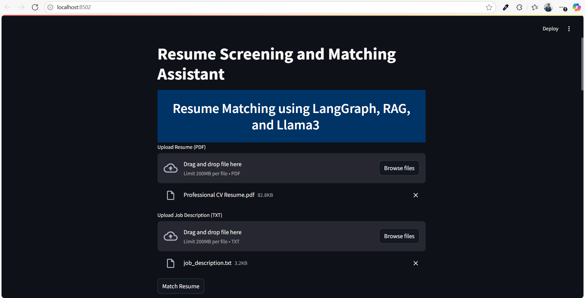

# AI-Powered Resume Matching App

This is a **Streamlit-based application** that leverages a powerful **AI multi-agent workflow** to intelligently **match resumes with job descriptions**. It utilizes modern LLM frameworks like **LangChain**, **LangGraph**, and **Llama 3** (open-source via **Groq**).

---

## Key Features

* Upload a **resume (PDF)** and a **job description (TXT or plain text)**.
* Click on **"Match Resume"** to start the AI workflow.
* The app:

  * Displays a **LangGraph workflow diagram** showing connected agents (nodes and edges).
  * Executes the AI workflow:

    * Shows **individual outputs** from each agent.
    * Provides a **final verdict** with a **match score**.
    * Delivers a **detailed explanation** of the decision.

---

## Candidate Score

The final **Recruiter Agent** evaluates the resume and job description, assigning a **match score out of 100** based on:

* Resume content
* Job description alignment
* External LinkedIn profile validation

> This score helps recruiters prioritize candidates efficiently.

---

## AI Agent Workflow

Here’s an overview of the agents involved and their roles in the system:

### 1. **Resume Agent**

* Extracts the **candidate’s name** and other key details from the uploaded resume.

### 2. **Job Description (JD) Agent**

* Analyzes the **job description** to extract **key requirements** and expectations.

### 3. **RedFlag Agent**

* Analyzes the resume to identify potential issues like job hopping, gaps, skill inconsistencies, missing education, and errors, then returns clear flagged points.

### 4. **Recruiter Agent (Final Decision Maker)**

* Combines insights from:

  * JD Agent
  * Redflag agent
  * Resume file
* Produces:

  * A **detailed evaluation**
  * A **match score (out of 100)**
  * The **final recommendation**

---

## Technologies Used

* **Python**
* **Streamlit**
* **LangChain + LangGraph**
* **Llama 3 (via Groq API)**
* **Hugging Face Instruct Embeddings**
* **Chroma DB (vector store)**
* **PyPDFLoader**
* **BeautifulSoup + Requests**

---

## Visual Workflow

The app dynamically generates a **LangGraph workflow diagram**, visually explaining the data flow between all agents. This provides complete transparency and traceability.

## Example Use Case

1. Upload a candidate’s **resume (PDF)**.
2. Upload or paste the **job description (TXT)**.
3. Click **"Match Resume"**.
4. Instantly get:

   * Agent workflow diagram
   * Outputs from each agent
   * **Final match score**
   * Recruiter's **reasoned verdict**

---

## 📬 Contact

**Haroon Sajid** – *AI Developer & Data Enthusiast*
- 📧 **Email:** [haroonsajid016@gmail.com](mailto:haroonsajid016@gmail.com)
- 🌐 **Website:** [haroonsajid.com](https://haroonsajid.com)

> Feel free to reach out for suggestions, feedback, or collaboration!